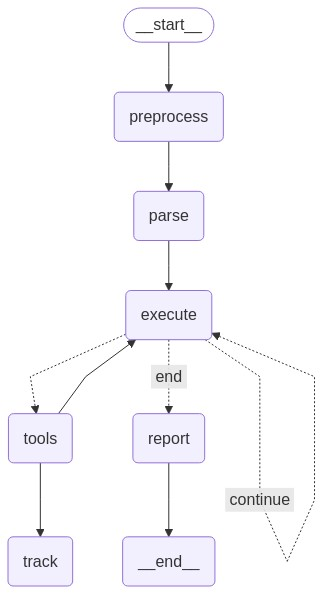

# Factifai Agent

[](https://www.npmjs.com/package/@presidio-dev/factifai-agent)
[](https://opensource.org/licenses/MIT)

## Overview

Factifai Agent is a sophisticated browser automation testing framework that leverages Large Language Models (LLMs) to interpret natural language test instructions and execute them through a structured, reliable process. Built on LangGraph and Playwright, it enables testers and developers to write test cases in plain English while maintaining precision and reproducibility.

The agent processes natural language instructions through a directed graph pipeline:



## Key Features

- **Natural Language Test Instructions**: Write test cases in plain English
- **LLM-Powered Test Interpretation**: Automatically converts natural language to executable test steps
- **Playwright Integration**: Leverages Playwright's robust browser automation capabilities
- **LangGraph Architecture**: Uses a directed state graph for reliable test execution flow
- **Cross-Browser Support**: Works across Chromium, Firefox, and WebKit
- **Detailed Test Reporting**: Generates comprehensive test execution reports
- **Step-by-Step Verification**: Validates each test step against expected outcomes
- **Automatic Retry Mechanism**: Intelligently retries failed steps
- **Multiple LLM Providers**: Supports OpenAI and AWS Bedrock

## Installation

```bash
# Install globally
npm install -g @presidio-dev/factifai-agent
```

## Quick Start

### With OpenAI

```bash
export OPENAI_API_KEY=your-api-key-here
factifai-agent --model openai run "Navigate to duckduckgo.com and search 'eagles'"
```

### With AWS Bedrock

```bash
export AWS_ACCESS_KEY_ID=your-access-key-id
export AWS_SECRET_ACCESS_KEY=your-secret-access-key
export AWS_DEFAULT_REGION=us-west-2
factifai-agent --model bedrock run "Navigate to duckduckgo.com and search 'eagles'"
```

## Architecture

Factifai Agent employs a robust LangGraph-based architecture:

1. **Preprocessing Node**: Formats and prepares the test instruction
2. **Parsing Node**: Converts natural language to structured test steps
3. **Execution Node**: Performs browser actions via Playwright
4. **Tracking Node**: Monitors test progress and status
5. **Tool Node**: Provides necessary tools for interaction
6. **Report Generation Node**: Creates detailed test results

## Commands

### Test Automation

```bash
# Run with test instructions in the command
factifai-agent --model openai run "Your test instructions"

# Run from a file
factifai-agent --model openai run --file ./examples/test-case.txt

# With custom session ID
factifai-agent --model openai run --session my-test-123 "Your test instruction"
```

### Configuration

```bash
# Show current configuration
factifai-agent config --show

# Set model provider
factifai-agent config --model openai

# Set a configuration value
factifai-agent config --set KEY=value
```

### Model Management

```bash
# List all available models
factifai-agent models
```

## Supported Models

| Provider | Configuration | Default Model |
|----------|--------------|---------------|
| **OpenAI** | `OPENAI_API_KEY` | `gpt-4.1` |
| **AWS Bedrock** | `AWS_ACCESS_KEY_ID`<br>`AWS_SECRET_ACCESS_KEY`<br>`AWS_DEFAULT_REGION` | `us.anthropic.claude-3-7-sonnet-20250219-v1:0` |

## Test File Format

Create structured test files for complex scenarios:

```markdown
**Objective:** Search on DuckDuckGo

**Test Steps:**

1. **Navigate to duckduckgo.com**
   * **Expected:** DuckDuckGo homepage loads

2. **Search for "eagles"**
   * **Action:** Type "eagles" in search box and press Enter
   * **Expected:** Search results for "eagles" appear
```

## Environment Variables

```bash
# Model selection
export MODEL_PROVIDER=openai  # "openai" | "bedrock"
export OPENAI_MODEL=gpt-4.1
export BEDROCK_MODEL=us.anthropic.claude-3-7-sonnet-20250219-v1:0

# API credentials
export OPENAI_API_KEY=your-api-key-here
export AWS_DEFAULT_REGION=us-west-2
export AWS_ACCESS_KEY_ID=your-access-key-id
export AWS_SECRET_ACCESS_KEY=your-secret-access-key
```

## Requirements

- Node.js 16+
- Playwright browsers (installed automatically via postinstall script)

## Learn More

- [Website](https://factifai.io)
- [GitHub Repository](https://github.com/presidio-oss/factifai-agent-suite)
- [Example Tests](https://github.com/presidio-oss/factifai-agent-suite/tree/main/examples)

## License

MIT © PRESIDIO®
